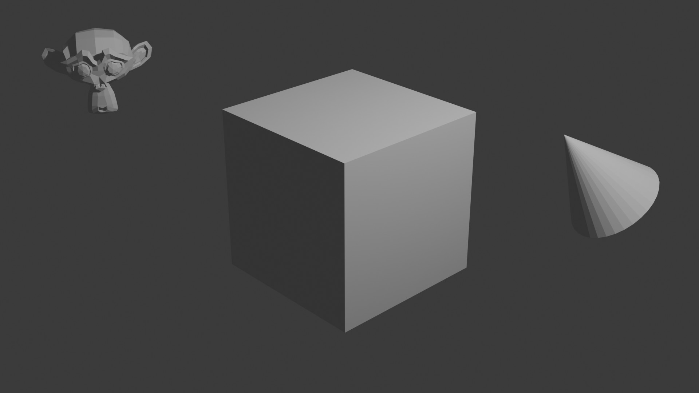
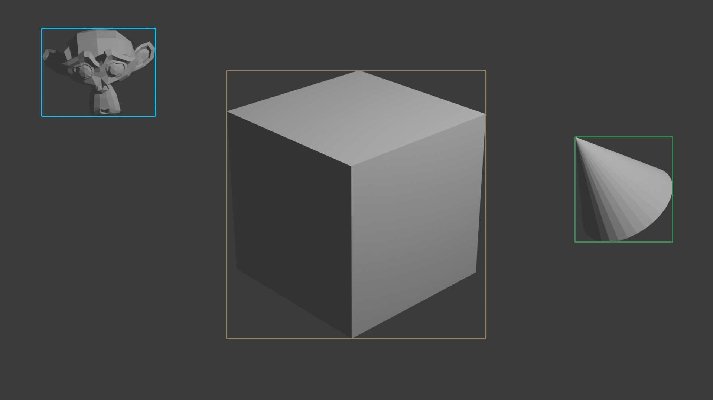
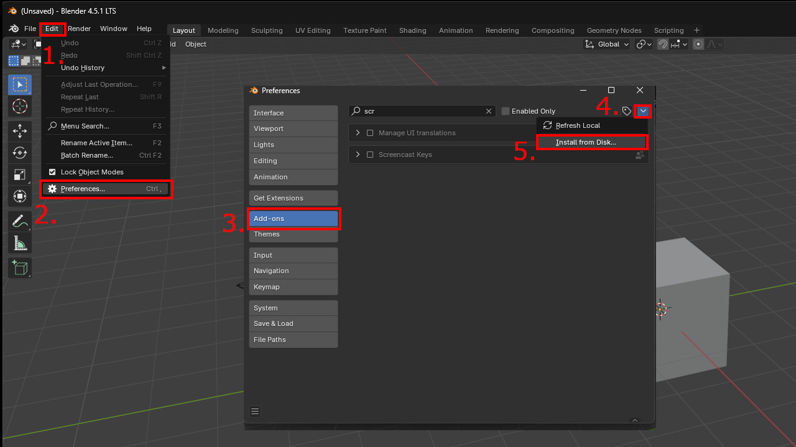
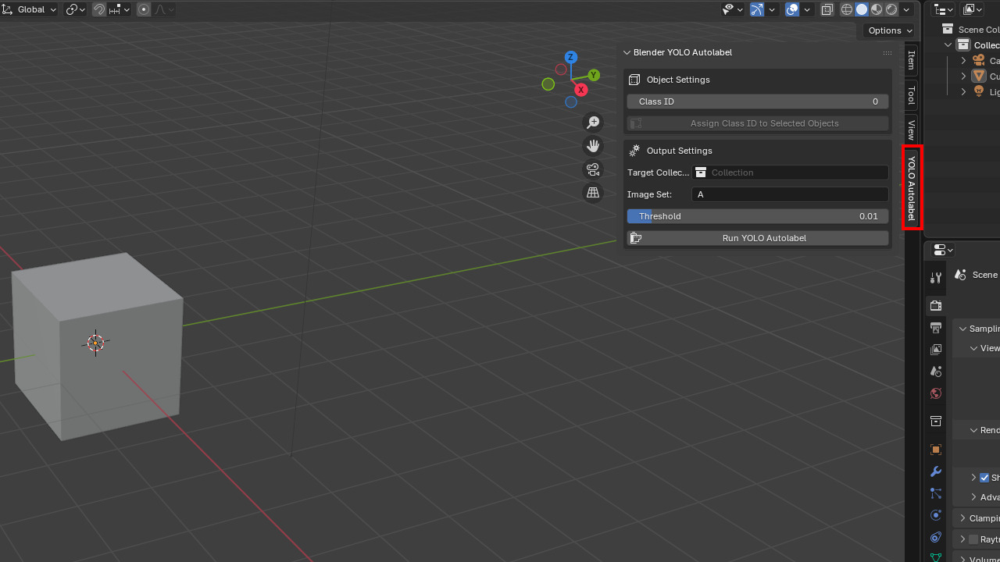
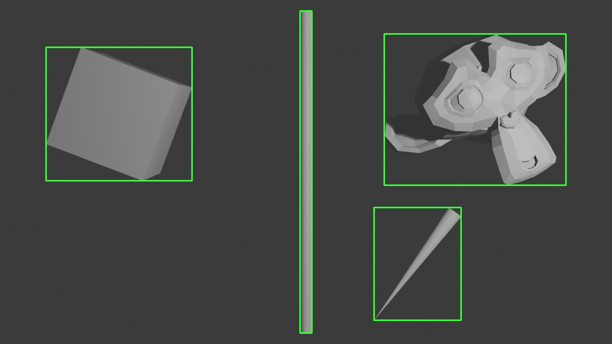
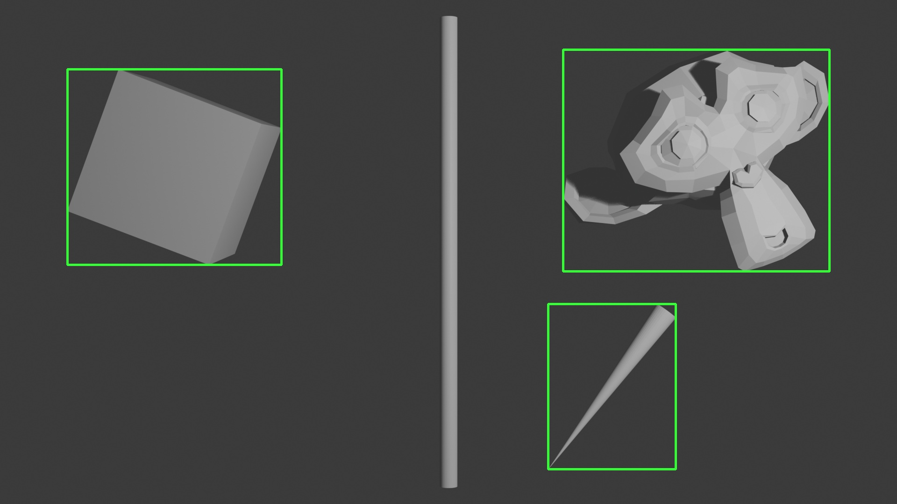

# Blender-YOLO-Autolabel

## What it does?

It's Blender script add-on that while rendering images also **generates labels** (class of object and bounding box) in format ready for [YOLO](https://github.com/ultralytics/ultralytics) training.

Before             |  After
:-------------------------:|:-------------------------:
  |  

## How to use?

### 1. Install add-on ⤵️

>[!Note]
> Blender 4.1 or newer required.

First, [download latest Release](https://github.com/qm4teo/Blender-YOLO-Autolabel/releases/latest) of the add-on. Then open [Blender](https://www.blender.org/) and install add-on by selecting downloaded `blender-yolo-autolabel.zip` file (without unzipping).


After installing it can be found in the right Sidebar (can be shown with `N` button if it's hidden).


### 2. Add objects and create scene ❇️

Add (create or import) objects that will be labeled with bounding boxes.
>[!Tip]
> Add-on script doesn't add any variations, so for better dataset diversity it's advised to animate camera, colors, background, etc...

### 3. Prepare for labeling 🔢

>[!Warning]
> Remember to **apply / bake** to keyframes all camera's transforms and modifieres!

#### a) Set Class ID

Select all objects that should be of given class (it can be changed to any non-negative integer value), and then hit `Assign Class ID to Selected Objects`.

>[!Tip]
>This value is stored as object custom property `class_id` and can be also tweaked manually there.

#### b) Set Target Collection

Only objects inside this collection will be considered for labeling.

#### c) Set Image prefix (optional)

Specify prefix for output images and labels. For example, `Image Set: A` will result in files `A_0001.jpg`, `A_0001.txt`...

#### d) Set Threshold (optional)

Threshold controls how thick object needs to be to get bounding box and label.

Threshold = 0.01          |  Threshold = 0.05  
:-------------------------:|:-------------------------:
  |  

### 4. Run ▶️

>[!Note]
> All output settings such as location, file format, and frame range are **taken from render settings**. Remember to set them beforehand!

When everything is ready, hit `Run YOLO Autolabel` and wait for results! 🕑

>[!Warning]
>After running script, Blender will start rendering with labels, however it will be unresponsive until finished. Progress can be seen through system console `Window` -> `Toogle System Console`.

## Output structure ⏏️

Inside location specified by Blender Output Preferences there will be folders with `images` and `labels`, each frame having corresponding label and name based on prefix and frame number.

```text
.
├── Project.blend
├── images
│   ├── 0001.png
│   ├── 0002.png
│   └── ...
├── labels
│   ├── 0001.txt
│   ├── 0002.txt
│   └── ...
├── (test_output.ipynb)
├── (test_utils.py)
└── ...
```

Each `label` contains **all** bounding boxes visible in image, in format:
`class_id relative_x_center relative_y_center relative_width relative_height`.

```text
0 0.585938 0.595833 0.184375 0.275000
1 0.551562 0.090625 0.162500 0.177083
0 0.115625 0.061458 0.221875 0.118750
. .    ...     ...      ...      ...
```

## View and check resuls ✅

To see if labels are generated as expected, open and run `test_output.ipynb` (it uses `test_utils.py`, `matplotlib`, `re`, `opencv`).
